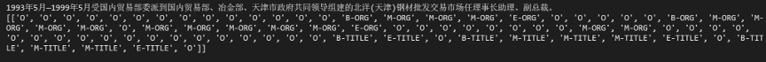
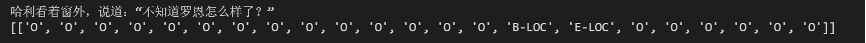
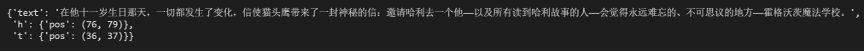
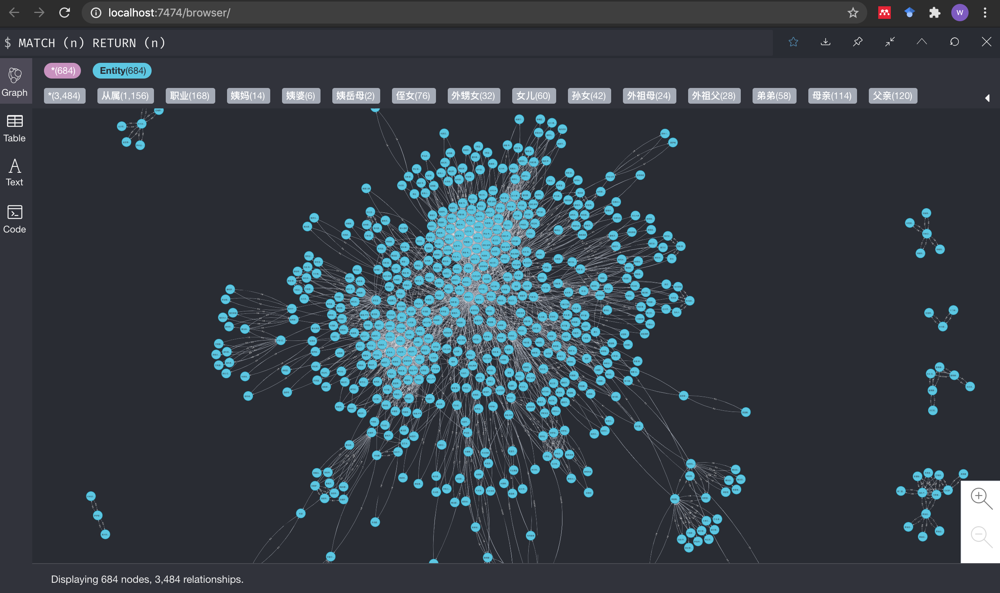
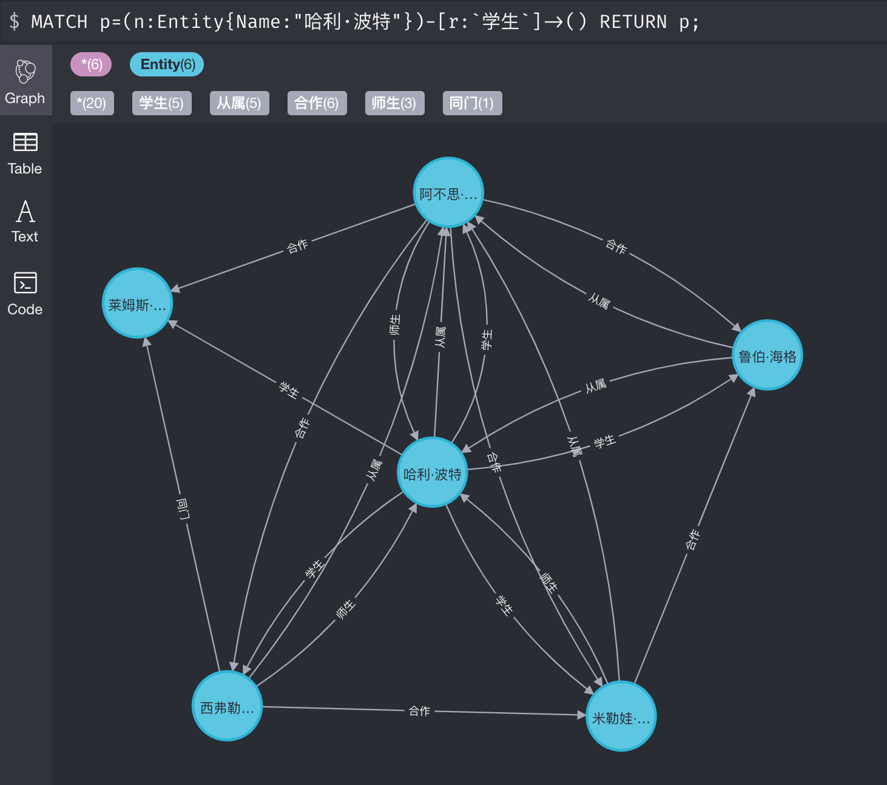
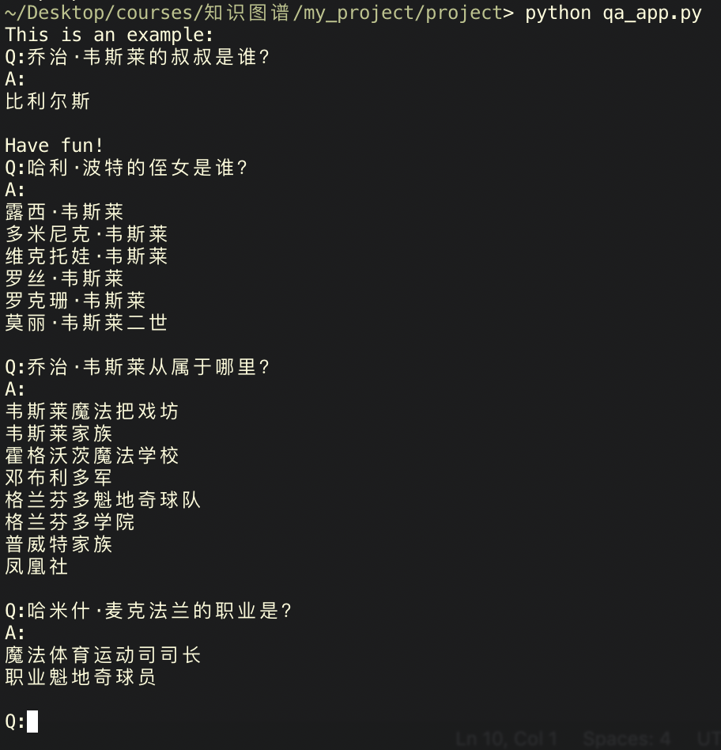

# 哈利·波特人物关系知识图谱

## 项目流程
本项目计划构建小说《哈利·波特》中的各种实体（包括人物、物品、组织、概念等）以及它们之间关系（包括人物与组织概念之间的从属关系以及人物关系等）的知识图谱。我们先利用爬虫技术从[哈利·波特中文维基网站](https://harrypotter.fandom.com/zh/wiki/%E5%93%88%E5%88%A9%C2%B7%E6%B3%A2%E7%89%B9%E7%BB%B4%E5%9F%BA:%E9%A6%96%E9%A1%B5)上抓取了所有的实体名称构建实体库。然后根据实体库逐条抓取了与实体相关的实体关系，构成初步的知识图谱三元组。由于网页上的文本信息以半结构化方式呈现，我们对抓取到的数据进行了预处理，使其符合知识图谱的存储规范。为对初步构建的知识图谱进行扩充，我们首先采用了预训练的实体识别模型从小说原文中提取更丰富的实体名称，以扩充实体库。然后采用预训练的关系抽取模型在小说原文中抽取现有实体之间的人物关系，以扩充实体关系，构建最终的知识图谱。在完成知识图谱的构建后，我们首先采用Neo4j图形数据库对知识图谱进行存储与可视化。然后在其基础上构建了一个简单的知识问答应用，用到的技术包括自然语言词性标注和知识图谱查询。

主要包括三部分工作：（1）数据获取与预处理；（2）实体识别与关系抽取；（3）可视化与知识问答。

## 数据获取与预处理
该步骤利用爬虫技术从哈利·波特中文维基网站上获取哈利·波特全文中出现的所有实体名称，以及多种特定的已知实体关系；并对获取的实体与实体关系进行预处理。以构建初步的知识图谱，并为之后的深度关系抽取做准备。

### 从半结构化数据中获取所有实体名称
哈利·波特中文维基网站中的提供了所有实体名称，其存在形式为半结构化数据，数据页面如下图所示：


该页面的特点：
1. 链接为 https://harrypotter.fandom.com/zh/wiki/Category:* 的形式，*表示某一实体类别。
2. 该类别的所有实体名称以字典序给出。

通过以预定义的实体类别为种子地址，可以获取所有实体名称。

操作指令：
```shell
cd get_raw_data
python extract_raw_entities.py
```

### 从半结构化数据中获取三元组
哈利·波特中文维基网站中的数据为半结构化数据，以实体费比安·普威特为例，其数据页面如下图所示：


该页面的特点：
1. 链接为 https://harrypotter.fandom.com/zh/wiki/* 的形式，*表示要查询的实体名称。
2. 主要关系数据以右侧的知识卡片形式给出。我们主要从中提取实体的家庭成员信息和从属关系信息。

从该页面提取到的三元组为：
```
费比安·普威特	从属	凤凰社
费比安·普威特	从属	普威特家族
费比安·普威特	叔叔	伊格内修斯·普威特
费比安·普威特	可能是兄弟	比利尔斯
费比安·普威特	哥哥	吉迪翁·普威特
费比安·普威特	妹夫	亚瑟·韦斯莱
费比安·普威特	妹妹	莫丽·韦斯莱
费比安·普威特	姨妈	穆丽尔
费比安·普威特	母亲	普威特夫人
费比安·普威特	父亲	普威特先生
费比安·普威特	阿姨	卢克丽霞·布莱克
```

操作指令：
```shell
cd get_raw_data
python extract_raw_relations.py
```

### 数据清理
该步骤对哈利·波特中文维基网站中可能存在的错误文本，不规则信息进行清理。

错误文本实例：
```
卢修斯·马尔福	职业	(?-1996年)
奥赖恩·布莱克	侄女)†[1	贝拉特里克斯·莱斯特兰奇
奥赖恩·布莱克	岳父/叔叔	帕勒克斯·布莱克
```

上述文本的特点与处理方法：
1. 实体名称错误。在模板匹配过程中，由个别不规则的数据导致。处理方法为直接删除。
2. 实体关系包含特殊字符。在模板匹配过程中，由个别不规则的数据导致。处理方法为删除实体关系中的特殊字符。
3. 实体关系为多个并列。处理方法为拆分为多个三元组。

操作指令：
```shell
cd get_raw_data
python clean_relations.py
```

## 实体识别与关系抽取

### 实体识别
#### 使用模型识别
我们首先基于bilstm搭建了一个中文命名实体识别模型来抽取句子中的实体。具体细节可见目录entity_recognition下的readme文档。

##### 数据集
我们共使用了两个数据集来训练实体模型。
1. 论文ACL 2018[Chinese NER using Lattice LSTM](https://github.com/jiesutd/LatticeLSTM)中收集的简历数据。数据的格式如下，它的每一行由一个字及其对应的标注组成，标注集采用BIOES，句子之间用一个空行隔开。
    ```
    美	B-LOC
    国	E-LOC
    的	O
    华	B-PER
    莱	I-PER
    士	E-PER

    我	O
    跟	O
    他	O
    谈	O
    笑	O
    风	O
    生	O
    ```
2. BosonNLP_NER，波森命名实体语料，由一段句子与其对应标注组成，选取其中一句预料如下。
    ```
    {{product_name:浙江在线杭州}}{{time:4月25日}}讯（记者{{person_name: 施宇翔}} 通讯员 {{person_name:方英}}）毒贩很“时髦”，用{{product_name:微信}}交易毒品。没料想警方也很“潮”，将计就计，一举将其擒获。
    ```
在训练前，会将BosonNLP_NER数据集处理成与前一个数据集相同的形式，并一同去训练我们的命名实体识别模型。

##### 处理结果
运行train_model.py训练实体识别模型，并在test_model.ipynb中对模型进行测试。我们首先从测试集中提取出一句语料进行测试。



测试集上测试的结果还是不错的，随后我们使用原文中的句子进行测试。



可以看出模型并没有将句子中的人物“哈利”识别出来，并将“罗恩”识别为了地点。通过后续测试我们也发现，训练的实体识别模型在原文上进行实体识别的结果并不好，分析可能是训练集中缺少了原文中的语料，以致模型表现不是很好。

#### 基于匹配的实体识别
通过我们已经从网页上爬取的实体名称，对句子中的实体进行匹配。具体细节可参考relation_extraction目录下的extract_relation_and_clean.ipynb。

我们首先将爬取得到的实体名进一步划分，例如实体“哈利.波特”则进一步划分为“哈利”与“波特”。遍历原文中的每个句子，找到包含两个及两个以上实体的句子，标注实体的位置。



使用匹配的实体识别方法相比我们训练的实体识别模型，能够更快以及更精确地识别句子中的实体，因此我们最终采取了直接匹配的策略来抽取原文中的实体。

### 关系抽取
1. 使用哈工大的BERT-wwm在20w中文人物关系数据上训练关系抽取模型；
2. 将《哈利·波特》原文进行分句，并根据此前构建的实体库筛选出含有多个实体的句子；
3. 使用训练完成的关系抽取模型抽取每个句子中实体间的关系；
4. 对得到的关系进行数据清洗，得到最终干净的关系数据。

操作步骤详见relation_extraction/README.md

#### 关系抽取预训练数据集
我们使用https://github.com/taorui-plus/OpenNRE提供的人物关系数据集，该数据集共包含父母、夫妻、祖父、师生、同门等十四个人物关系，选取其中一个语料如下。
```
{"token": ["后", "世", "解", "州", "、", "当", "阳", "、", "洛", "阳", "等", "地", "关", "姓", "氏", "族", "，", "常", "自", "称", "为", "关", "兴", "后", "裔", "，", "关", "羽", "-", "历", "史", "概", "括", "关", "兴", "蜀", "侍", "中", "、", "中", "监", "军", "。"], "h": {"name": "关兴", "pos": [21, 22]}, "t": {"name": "关羽", "pos": [26, 27]}, "relation": "父母"}
```

#### 模型训练
有关关系抽取部分的工程放在relation_extraction目录下，具体细节可以参考目录下的readme。运行目录下的train_people_chinese_bert_softmax.py训练BERT中文关系抽取模型。

#### 模型测试
我们使用训练好的模型对标注好实体的句子进行关系抽取。
```
model.infer({'text': '在他十一岁生日那天，一切都发生了变化，信使猫头鹰带来了一封神秘的信：邀请哈利去一个他——以及所有读到哈利故事的人——会觉得永远难忘的、不可思议的地方——霍格沃茨魔法学校。', 'h': {'pos': (76, 79)}, 't': {'pos': (36, 37)}})
识别结果为(‘夫妻’, 0.4354833984309)
```
由于此处实体“霍格沃兹”为地区，并不适用我们的模型，但我们也发现，通过模型识别出的关系许多是错误的，因此完成抽取后还需要对数据进行清洗。

#### 关系数据清洗与关系推理
1. 抽取的关系中包括父母亲、夫妻、祖父母等，但从网站上爬取的关系数据中亲属关系已经非常详细的，因此我们这里主要关注师生、合作等关系；
2. 由于不同句子可能会包含相同的实体对，导致最终可能一个实体对会存在多个关系，我们选择概率最高的一组作为最终的关系；
3. 句子中的实体对还可能存在歧义，我们使用候选实体中在文章中出现频率最多的实体来替换；
4. 最终手动剔除掉一些明显的错误，得到最终的关系数据；
5. 对已抽取得到的关系进行简单推理，例如：
```
  A 师生 B --> B 学生 A 
  A 同门 B & B 同门 C --> A 同门 C
```

操作步骤详见relation_extraction/README.md

### 扩充初始知识图谱
将该步骤中经过实体识别与关系抽取得到的三元组与由最初构建的知识图谱进行融合，增加额外的三元组，合并相同的三元组。

操作指令：
```shell
python relation_fusion.py
```
可以得到最终的relations_final.csv文件。

## 可视化与知识问答

### 将知识图谱数据导入Neo4j图形数据库
1. 下载[Neo4j](https://go.neo4j.com/download-thanks.html?edition=community&release=3.5.26&flavour=unix&_gl=1*1qxx7d8*_ga*NjYxODMxNzk5LjE2MTExNDEyMjg.*_ga_DL38Q8KGQC*MTYxMTgyNzAzNC41LjAuMTYxMTgyNzAzNC4w&_ga=2.6814066.19926572.1611799507-661831799.1611141228)，并解压运行：
    ```
    tar -xf neo4j-community-3.5.26-unix.tar
    cd neo4j-community-3.5.26
    cd bin
    ./neo4j start
    ```
2. 更改数据库密码为：123456
3. 采用Neo4j的python接口py2neo库将知识图谱csv数据文件中的三元组逐条存储至Neo4j数据库。

    操作指令：
    ```shell
    python neo_db/creat_graph.py
    ```

### 知识图谱可视化与查询
在导入了知识图谱数据后，在Neo4j本地网页端，可以进行可视化和知识查询操作。

1. 可视化整张知识图谱。在Neo4j本地网页终端中输入：
    ```
    MATCH (n) RETURN (n)
    ```
    

2. 知识查询。例如，在Neo4j本地网页终端中输入：
    ```
    MATCH p=(n:Entity{Name:"哈利·波特"})-[r:`学生`]->() RETURN p;
    ```
    

### 知识问答
#### 问题解析
该部分采用pyltp工具库对中文自然语言问题进行词性标注，取词性为名称的词语作为问题关键词，并假设问句中的第一个名称词语为实体名称，第二个名称词语为关系名称。

例如，问句：
```
哈利·波特的侄女是谁？
```
解析得到“哈利·波特”和“侄女”两个名称性词语。

#### 答案查询
采用Neo4j查询语句查询知识图谱，返回问题答案。

例如，问句：
```
哈利·波特的侄女是谁？
```

查询得到的答案为：
```
露西·韦斯莱
多米尼克·韦斯莱
维克托娃·韦斯莱
罗丝·韦斯莱
罗克珊·韦斯莱
莫丽·韦斯莱二世
```

更多问答结果：

