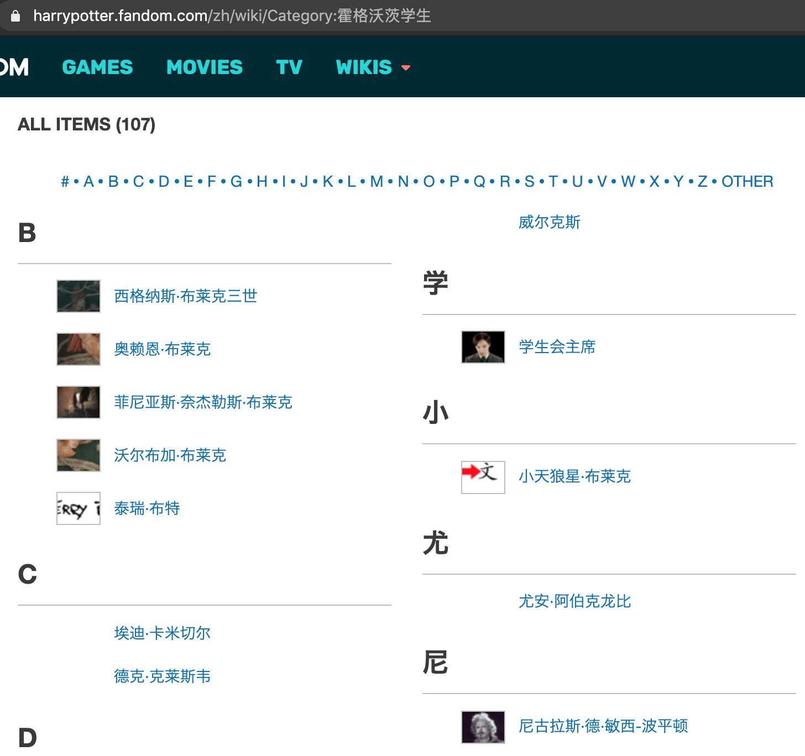
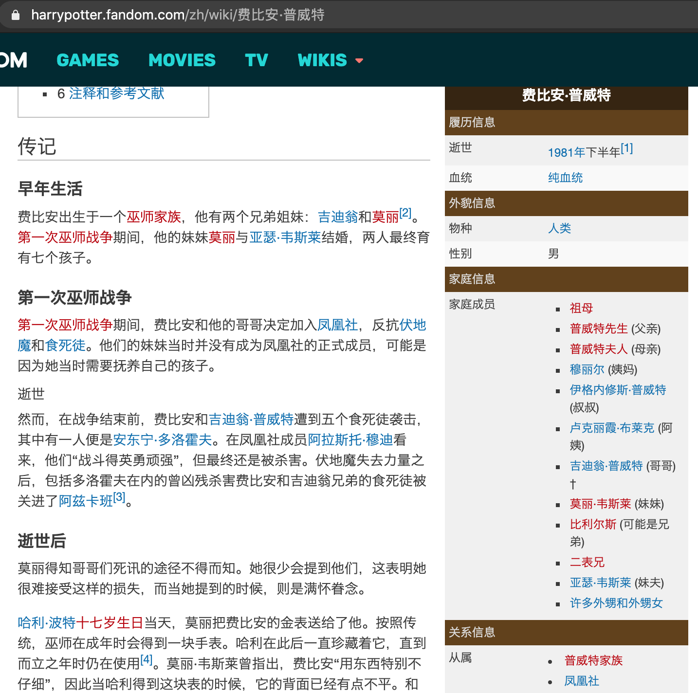

# 数据获取与预处理
该步骤利用爬虫技术从哈利·波特中文维基网站上获取哈利·波特全文中出现的所有实体名称，以及多种特定的已知实体关系；并对获取的实体与实体关系进行预处理。以构建初步的知识图谱，并为之后的深度关系抽取做准备。

## 代码说明
- extract_raw_entities.py
    
    以哈利·波特中文维基网站的多个预定义的种子网址出发，爬取所有实体名称。

- extract_raw_relations.py
    
    根据实体名称列表，逐条访问哈利·波特中文维基网站的半结构化数据，根据预定义的数据模板抽取已知的基本实体关系。

- clean_relations.py

    对获取到的基本三元组进行清理。包括去除缺失值，修改不符合规则的名称等。

## 数据文件说明
- entities.txt

    获取到的所有实体名称，包括人名、物名、组织名称和概念名称等。每行一个实体，总计461个实体。

- relations.txt

    获取到的未清理的三元组，实体关系包括各种人物家庭关系和人物对组织的从属关系等。每行一个三元组，总计1715条。

- relations_clean.txt

    清理后的三元组，总计1621条。作为哈利·波特知识图谱的初步知识库。

## 从半结构化数据中获取所有实体名称
哈利·波特中文维基网站中的提供了所有实体名称，其存在形式为半结构化数据，数据页面如下图所示：



该页面的特点：
1. 链接为 https://harrypotter.fandom.com/zh/wiki/Category:* 的形式，*表示某一实体类别。
2. 该类别的所有实体名称以字典序给出。

通过以预定义的实体类别为种子地址，可以获取所有实体名称。


## 从半结构化数据中获取三元组
哈利·波特中文维基网站中的数据为半结构化数据，以实体费比安·普威特为例，其数据页面如下图所示：



该页面的特点：
1. 链接为 https://harrypotter.fandom.com/zh/wiki/* 的形式，*表示要查询的实体名称。
2. 主要关系数据以右侧的知识卡片形式给出。我们主要从中提取实体的家庭成员信息和从属关系信息。

从该页面提取到的三元组为：
```
费比安·普威特	从属	凤凰社
费比安·普威特	从属	普威特家族
费比安·普威特	叔叔	伊格内修斯·普威特
费比安·普威特	可能是兄弟	比利尔斯
费比安·普威特	哥哥	吉迪翁·普威特
费比安·普威特	妹夫	亚瑟·韦斯莱
费比安·普威特	妹妹	莫丽·韦斯莱
费比安·普威特	姨妈	穆丽尔
费比安·普威特	母亲	普威特夫人
费比安·普威特	父亲	普威特先生
费比安·普威特	阿姨	卢克丽霞·布莱克
```

## 数据清理
该步骤对哈利·波特中文维基网站中可能存在的错误文本，不规则信息进行清理。

错误文本实例：
```
卢修斯·马尔福	职业	(?-1996年)
奥赖恩·布莱克	侄女)†[1	贝拉特里克斯·莱斯特兰奇
奥赖恩·布莱克	岳父/叔叔	帕勒克斯·布莱克
```

上述文本的特点与处理方法：
1. 实体名称错误。在模板匹配过程中，由个别不规则的数据导致。处理方法为直接删除。
2. 实体关系包含特殊字符。在模板匹配过程中，由个别不规则的数据导致。处理方法为删除实体关系中的特殊字符。
3. 实体关系为多个并列。处理方法为拆分为多个三元组。
